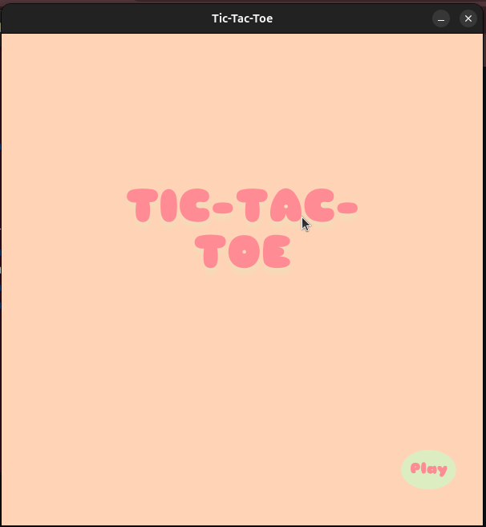
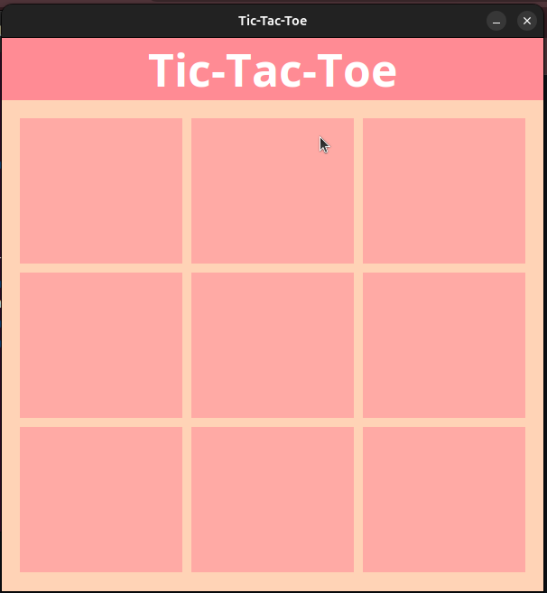
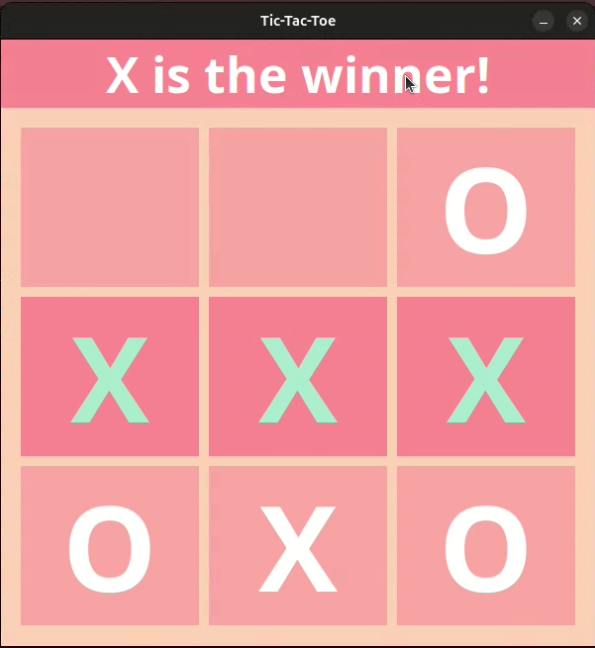
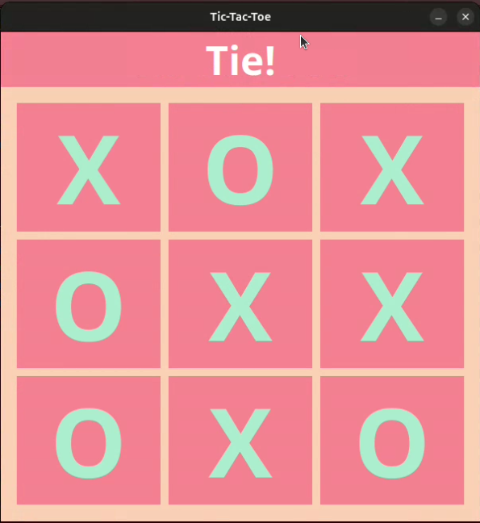
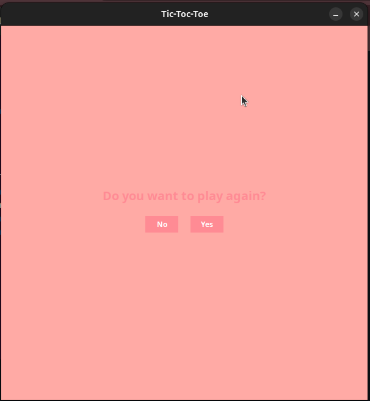
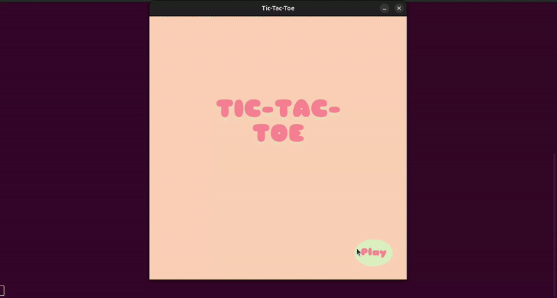

# 🌸 Tic-Tac-Toe

🎮 A cute Tic-Tac-Toe game developed in **Java** using **Swing**.  
🕹️ Challenge your friends and see who becomes the undefeatable champion!

---

# 🌼 Explore the Interface

## ⭐ Start Screen
Your journey begins here!

  

---

## 🎮 Gameplay Screen
This is where the magic happens! Take your turns wisely and try to outsmart your opponent.  

  

---

## 🏆 Winner Screen
Victory! This screen celebrates the player who managed to connect the perfect three-in-a-row.  

  

---

## 🤝 Tie Screen
No winner this time... Oh, but don't worry, great battles can end in balance!  

  

---

## 🔁 Play Again Screen
Finished a match? Decide whether you want to go for another round or leave the battlefield.  

  

## 🎥 Let's see it working

  

